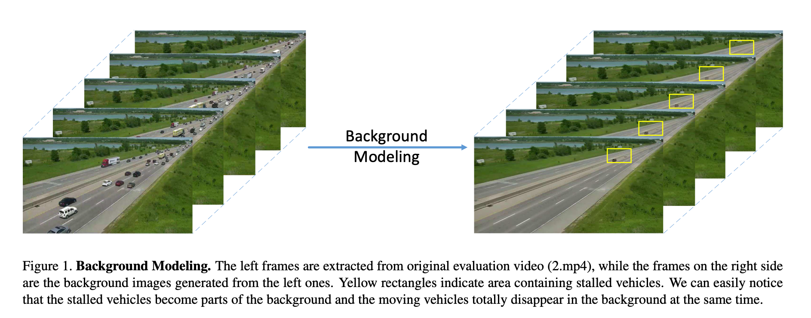
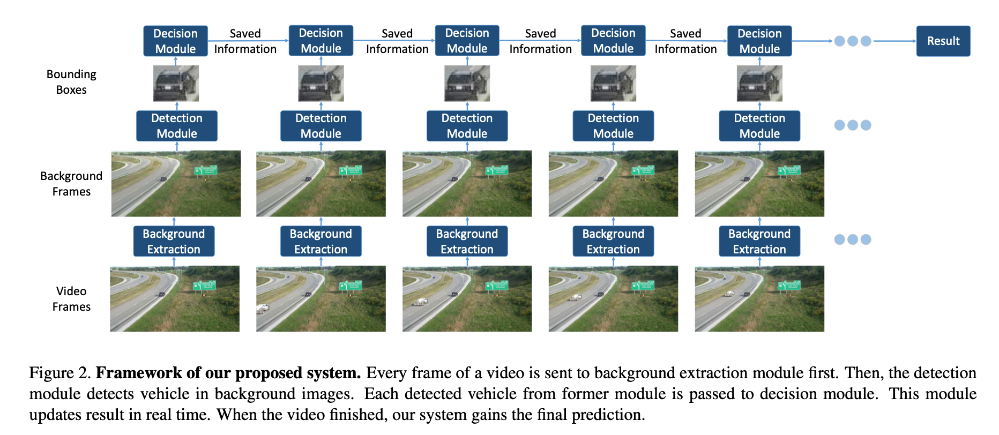
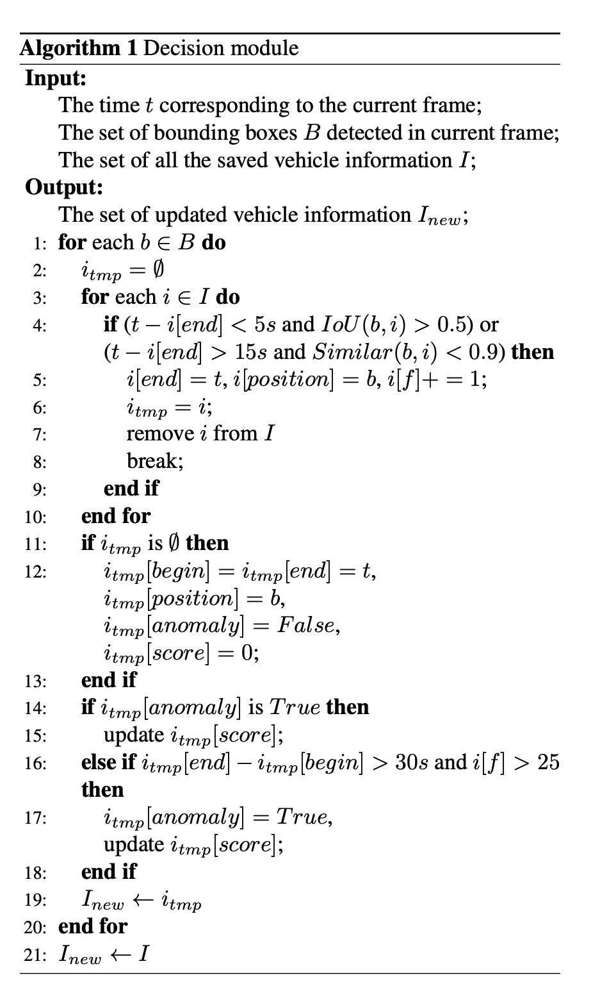
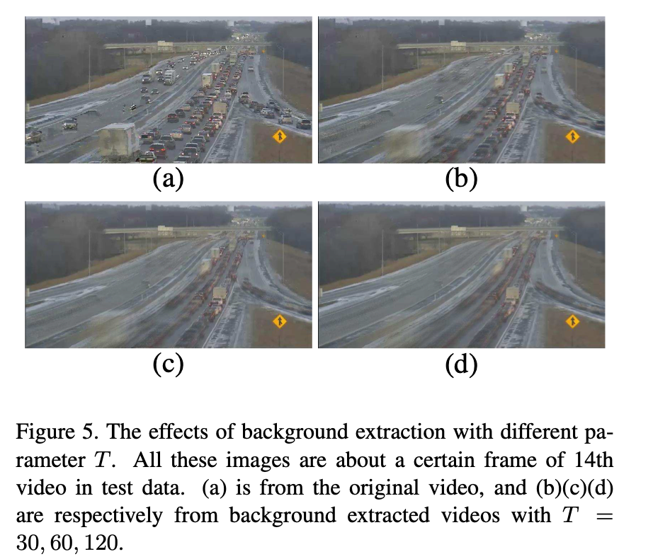
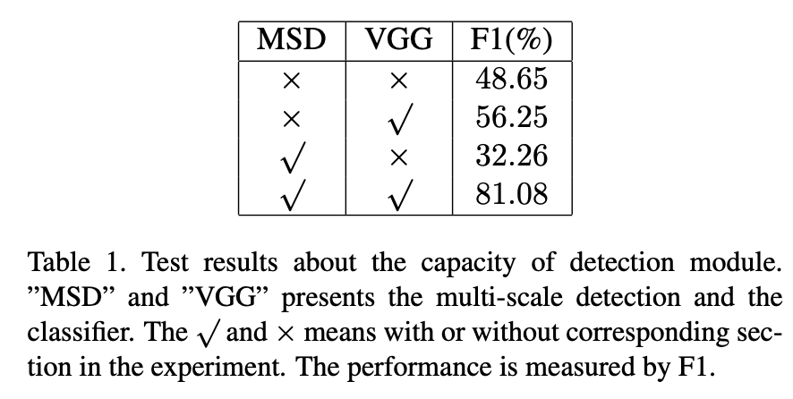
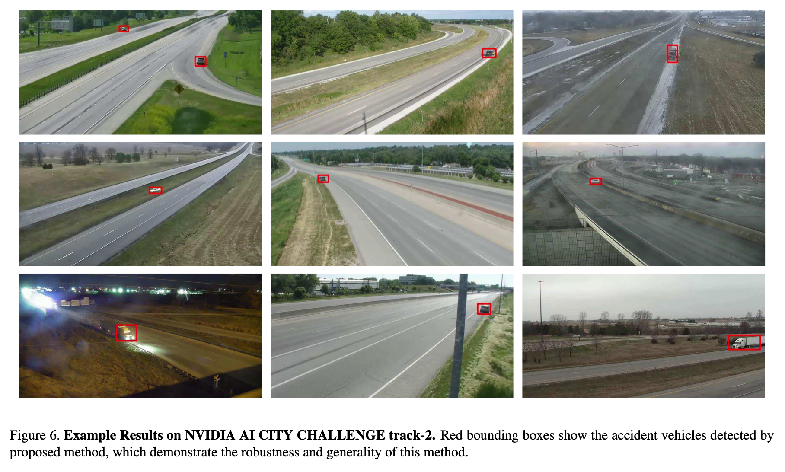

## Unsupervised Anomaly Detection for Traffic Surveillance Based on Background Modeling 

Paper Link : [Link](https://openaccess.thecvf.com/content_cvpr_2018_workshops/papers/w3/Wei_Unsupervised_Anomaly_Detection_CVPR_2018_paper.pdf)


### Abstract
Anomaly Detection을 수행하는데 있어서, 가장 큰 문제는 Lack of Labeled Dataset 이라는 점이다.
해당 논문에서 중점으로 살펴보는 Dataset은 [NVIDIA AI CITY CHALLENGE track-2](https://www.aicitychallenge.org/2022-challenge-tracks/)
으로, Anmalous Vehicles에 초점을 두었다.

해당 논문에서는 다음과 같은 가정을 두고 ```Unsupervised Anomaly Detection method를 제안했다.```
- 자동차 주행도로에서 상대적으로 오랜시간 멈춰있다면 해당 vehicle은 Anomaly로 간주한다.
- 이러한 기법을 기반으로 Background modeling을 기반으로 하여 교통감시를 진행
    - 다양한 배경이 있는 곳에서 다룰 수 있을 뿐만 아니라, labeled data의 의존성없이 저해상도 비디오에서도 잘 작동함

- ```MOG2``` Method를 도입
    - Moving Vehicle을 foreground처리하여 Remove
- Faster R-CNN 을 통해서 Background를 추출하고 특정한 조건하에 새로운 이상치를 결정할 수 있음


### Introduction
Anomaly Detection Method의 상당한 발전(CAE, GAN,OCC)을 했음에도 불구하고, 대부분 존재하는 방식들은 다음과 같은 2가지 이유로 실제 케이스를 다루지 못함
1. 대부분의 방식들은 UCSD, CUHK Avenue처럼 동일한 배경에서 일어나는 이상치 데이터셋이다. 실제 세계는 배경이 다양함.
2. 교통 감시카메라와 같은 이상치탐지는 결과적으로는 모든 종류의 scene에서 수행이 가능해야하는데, 이러한 방식은 아직까지 발전하지 않았다.


### Method
논문의 저자는 다음과 같은 방식들은 제안

<p>

</p>

- 다음과 같은 방식을 통해서 우선적으로 Moving Vehicle들을 제거 한 후, 
- Object Detection Module을 통해서 멈춰있는 Object(e.g. Stopped Vehicle)을 탐지
- 이후 빨간 신호등으로 인한 정체시간 보다 오래 멈춰있는 경우 Anomaly로 판단

<p>

</p>

- 다음과 같은 3개의 Module로 작동한다.
1. Every Frame마다 배경 이미지를 추출 $\rightarrow$ Using MOG2
2. Objet Detection Module을 통해서 vehicle을 Detection
3. Decision Module을 통해서 Anomaly를 판단
    * Background에 머무르는 시간
    * anomaly가 발생했을때의 timestamp
    * triplet loss로 훈련된 Resnet을 이용하여 신호등과 배경의 효과를 제거

<p>

</p>

- $begintime$ : vehicle이 최초로 등장한 시간
- $endtime$ : vehicle이 마지막으로 나타난 시간
- $frequency$ :  vehicle이 얼마나 등장했는지(Frame의 개수)
- $anomaly$ : normal or Anomaly 인가?
- $score$ : confidence of predicted anomaly

위의 알고리즘을 보면 , Bounding box는 매 프레임마다 Detection Module을 통해서 만들어짐. 만들어진 BBox를 decision Module로 전달하여 해당 알고리즘을 실행함
- 만약 ODM을 통한 BBox가 이전의 Frame정보 즉 saved Information과 일치하지 않는다면 (e.g 이전의 프레임에서 나타났던 차가 아닌경우) 새로운 vehicle이라고 저장


#### Anomaly Score 
위의 알고리즘을 통해서 결과적으로 Anomaly Score를 측정해야 하는데, 다음과 같은 식으로 구할 수 있다.
$$ score = \frac{frequency}{end\_time - begin\_time}$$
- 위의 식은 vehicle이 나타났다가 사라졌을때 까지의 total Frame을 포함하고 있음
- 해당 논문의 저자는 Score $\geq$ 0.3 일경우 Anomaly Detection이라고 가정한다.
- 또한 120초 이상 머물렀을 경우 100% anomaly라고 가정

여기서 조금 더 정확한 Timestamp를 얻기 위해서는 이상치가 있는 자동차(A라고하자)를 역추적해봐야 한다.
역추적을 진행할 때 score가 0.3보다 크다라는 것을 확정지은 후 original video에서 previous frames으로 역추적을 진행한다.
다음과 같은 방식으로 진행이 된다.
- 이상치라고 판단한 자동차(크기가 W x H)의 중심을 기점으로 7W x 7H 크기를 가지는 지역을 중점으로 Detection Module을 다시 실행하여 vehicle  $A^{'}$을 탐지한다.
- A와 $A'$의 IoU값이 0.5 이상이라면 같은 자동차라고 간주하고 7W x 7H에서 $A'$이 Original video에서 사라지는 시간을 설정한다.


### Experiments

#### Datasets
- UA-DETRAC (Faster R-CNN pretrain)
    - 84k frames & 578k annotated bounding boxes 
    - high resolutions로 인해 Gaussian blur 처리를 진행함
    - $G_i = \alpha * e^{-(i-(k-1)/2)^2/ (2*\sigma^2)}$를 각각의 dimension에 적용 $\rightarrow$ Size : $K \times 1$
    - $i = 0, \dots,K-1$
    - $ \alpha $ := scale factor s.t $\sum_iG_i = 1$, 
    - 논문에서는 K=5, $\sigma$ X=5, $\sigma$Y = 5

$$ I_m[i,j][c] = a \times I_o[i,j][c] + b \tag{1}$$
    - i,j : position of i,j , c := channels, a = 0.7, b=10

- 이후에 어두운 배경의 데이터셋이 부족하기 때문에 Extra-Video로 6분10초정도 되는 video clip을 더 사용


- Data for Classification
    - VGGNet(ImageNet, UIUC Car Detection, GTI, Cars Dataset)

- Data for similarity
    - ViRe를 이용하여 ResNet50을 triplet Loss로 훈련 
    - 776개의 자동차에 대해서 50K의 Images를 가지고 있음
        - 20개의 카메라로 찍힘

### Results
<p>

</p>

- T = 30, 60 ,90 ,120에 따른 Blurring 후 Background Extraction

<p>

</p>

- Multi Scale Detection과 VGG를 사용 유무에 따른 성능이다. (좀 당연한듯)


<p>

</p>

- Red Bounding box는 Accident가 난 vehicle이다.
# Unsupervised-Anomaly-Detection-for-Traffic-Surveillance-Based-on-Background-Modeling-
